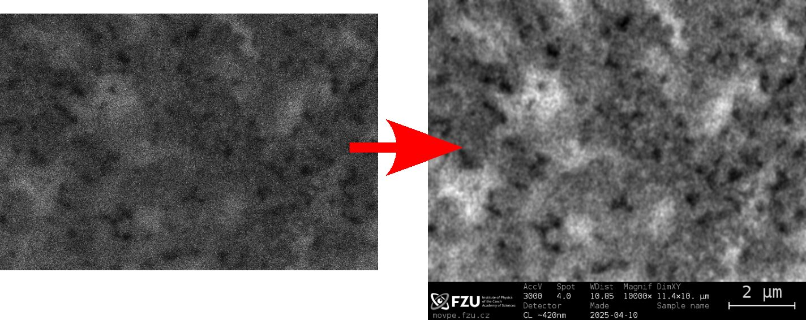
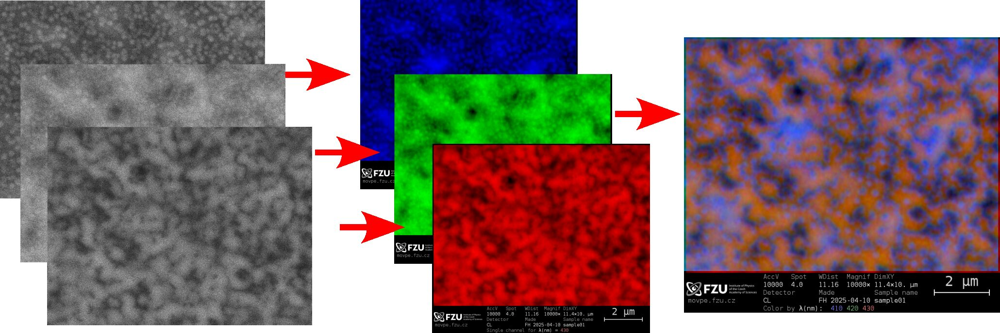
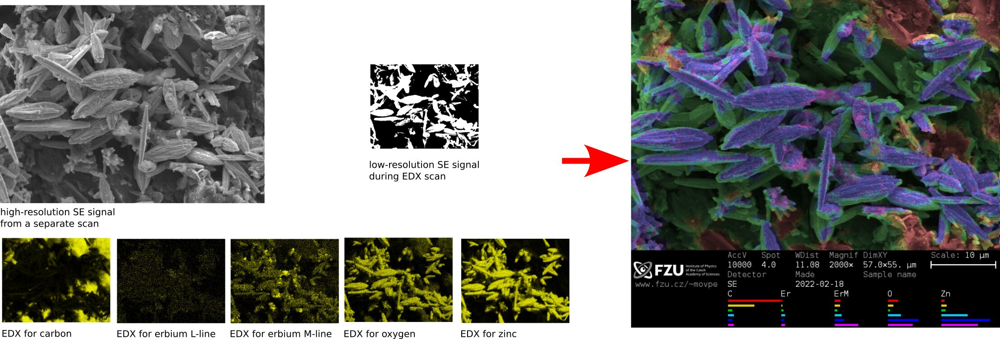

# SEM Image Postprocessing

## Overview

The old Philips XL30 microscope produces TIFF files that often need some processing before they can be presented; also their data bar obscures about 20% of the acquired image area. This project provides following Python scripts:
* **annotate.py** - converts each TIFF into a publication-ready PNG file,
* **multichannel-overlay.py** - composes a coloured image from a set of TIFF files corresponding to [cathodoluminescence maps](https://en.wikipedia.org/wiki/Cathodoluminescence) at different wavelengths,
* **edx_material_clustering.py** - composes a coloured image from one SEM image and a set of [EDX mappings](https://en.wikipedia.org/wiki/Energy-dispersive_X-ray_spectroscopy) corresponding to different elements. 

The function of each script is described below. 

The scripts ```annotate.py``` and ```multichannel-overlay.py``` can be used from command line (accepting a list of files to be processed), or as ordinary applications which ask for the files in a graphical dialog.

---

## annotate.py

Every TIFF image can be individually enhanced using ```annotate.py```, which automatically 
* stretches its contrast, 
* removes noise (adaptively blurring the image if applicable), 
* fixes anisotropy and 
* adds a nice databar below the image, with all important information taken from the data stored in the TIFF file header. 



---

### multichannel-overlay.py

If a series of two or more cathodoluminescence images was taken at the same place, it can be both instructive and appealing to colorize each image as a different colour channel and  compose them into a very information rich RGB image:



However, the cathodoluminescence mappings are taken as a sequence, and over few minutes the apparent SEM/CL image can drift a bit as a result of microscopic table movement or electric charging of the sample. Therefore, the images will need automatic alignment to each other. 

Moreover, these effects occur also during single frame acquisition, resulting in the images getting slightly distorted by stretching, skewing or rotation. Correcting this may require also to compensate for this *affine transform* artifacts during alignment. 

This script does (optionally) both. It also exports individual channels as separate PNG images for visual analysis. 

Finally, two composite images are exported, one of these with an enhanced colour contrast. 

If an ordinary secondary-electron (SE) image is included in the stack of images, the scripts labels it as "extra" channel, aligns it automatically with the individual CL channels, but of course it won't put it into the coloured stack of CL images. 

The configuration of the alignment process is governed by a short ```config.txt``` file, saved in the same directory as the provided TIFF images. The processing can be re-run when this file is changed, allowing for a greater flexibility of the multi-image processing. By default, the configuration should satisfactorily work for ordinary CL images. 

Most often the CL images differ by wavelength selected by a monochromator in the detection path, which is reflected in each image's name. However, alignment of images differing by some other quantitiy is also possible. The following result stacked images taken with different electron-beam energy instead - this clearly needed to fix a very pronounced image distortion!  

---

### edx_material_clustering.py

Secondary electron (SE) images typically produced by a SEM are greyscale, showing very limited information on the material composition of the sample. 

The EDX mapping for different X-ray emission lines of constitutive elements contain this information, but often are of very limited resolution, losing a lot of detail the SE image has.



It is fairly nontrivial to combine both sources of information to produce composite SE images that are color tinted by the actual material. In this script we employ an original approach to achieve this. This script works with the concept of each place in the EDX mapped images being a vector; for N elements being mapped, the pixel corresponds to a vector in N-dimensional space. Similar compositions would result in similar positions in the space; as a result, each material found in the sample should have its own "cloud of points". Note that even two materials containing the same elements (e.g. magnetite and hematite) should form slightly different clouds in the N-spacel.

Having generated such an array of vectors, the script uses the [K-means clustering algorithm](https://docs.scipy.org/doc/scipy/reference/generated/scipy.cluster.vq.kmeans.html) to find the likely materials, assigning each material with a color. Then it anneals the color assignment so as to assign materials similar in composition with similar colors, if possible. The number of materials is user supplied in the script and may or may not be equal to the number of EDX mappings. 

Finally it aligns the generated color map with the high-resolution SE image, and colorizes it. 

The databar is added like with the other scripts, but now it also contains small coloured bands for the *center vector* of each material "cloud", visually assigning each colour to its material. However, the script is entirely oblivious about chemistry, and some materials can be unrealistic (like, e.g., the deep X-ray shades in the valleys of the sample corresponding to generally very low EDX signal). This script doesn't require flat samples, but it gives better results for them.

Numerous options can be changed in the body of the script. This feature is still experimental - you may need to adapt this script to work for your user case.

---

### pure_numpy_image_processing.py

Aside of these three scripts, the **pure_numpy_image_processing.py** module provides common high-level operations with the images, potentially useful in other applications. It implements following convenient operations with 3D numpy arrays (*ndimage* of shape HEIGHT x WIDTH x 3):
* contrast auto-stretching,
* removal of "salt" noise (typical for spike noise in photomultiplier tubes),
* Gaussian blurring,
* Gaussian de-blurring (unsharp masking),
* color (de)saturation,
* affine transform & shift,
* corresponding 4+2-parameter image alignment (with regards to best Laplacian match),
* automatic cropping of black borders common for a set of images, 
* color-tinted overlaying of images, 
* adding lines, images and pre-rendered antialiased text in the images, 
* generating a color palette for the CL stack.


## Installation

This repository contains Python scripts, which should work both on Windows and Linux. 

Download or clone this repository to any folder. 

Make sure your computer has Python 3.8+ with compatible ```numpy```, ```imageio``` and ```scipy``` modules. 

Then run one of the scripts listed below to process the images. 

## Error reporting

These scripts were developed as a convenience tool in the Scanning Electron Microscope laboratory at the FZU - Institute of Physics, Czech Academy of Sciences in Prague. 

While they have been used on daily basis for a few years, the codebase is somewhat ugly and there may still be some errors or quirks. Please feel free to report them in an issue - I will try to fix them. 


## Licensing

This project was released under the MIT license. 

2018-2025 Filip Dominec


